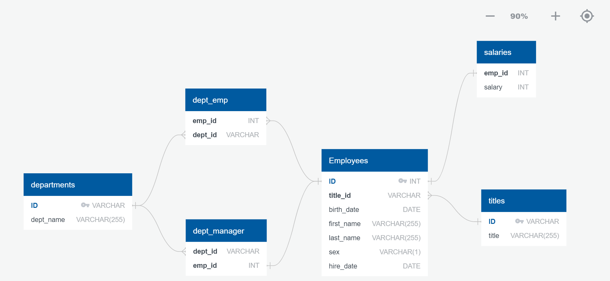
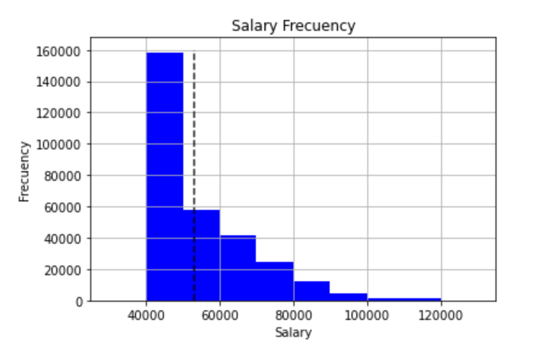
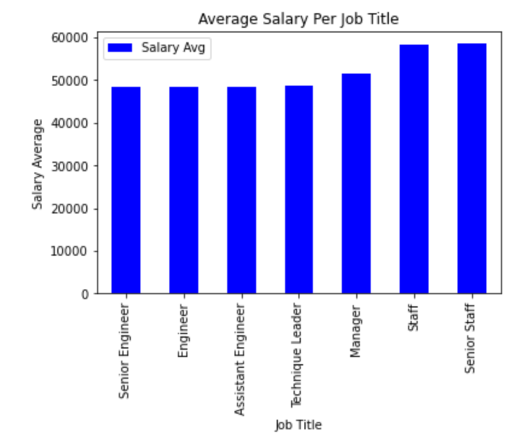

# Employee Database SQL Project

## Research project on employees of the Pewlett Hackard Corporation from the 1980s and 1990s.
###### This project has two connected parts: Data Engineering and Data Analysis

#### Data Engineering

###### Database design from six CSV files:

#### Data Analysis

##### Postgresql Analysis

###### Through SQL queries the following questions were answered:

###### 1. Employee number, last name, first name, sex, and salary.

###### 2. First name, last name, and hire date for employees who were hired in 1986.

###### 3. Manager of each department with the following information: department number, department name, the manager's employee number, last name, first name.

###### 4. Department of each employee with the following information: employee number, last name, first name, and department name.

###### 5. First name, last name, and sex for employees whose first name is "Hercules" and last names begin with "B."

###### 6. Employees in the Sales department, including their employee number, last name, first name, and department name.

###### 7. Employees in the Sales and Development departments, including their employee number, last name, first name, and department name.

###### 8. Frequency count of employee last names, i.e., how many employees share each last name.

##### Pandas Analysis

##### Salary Distibution

##### Average Salary Per Job Title

